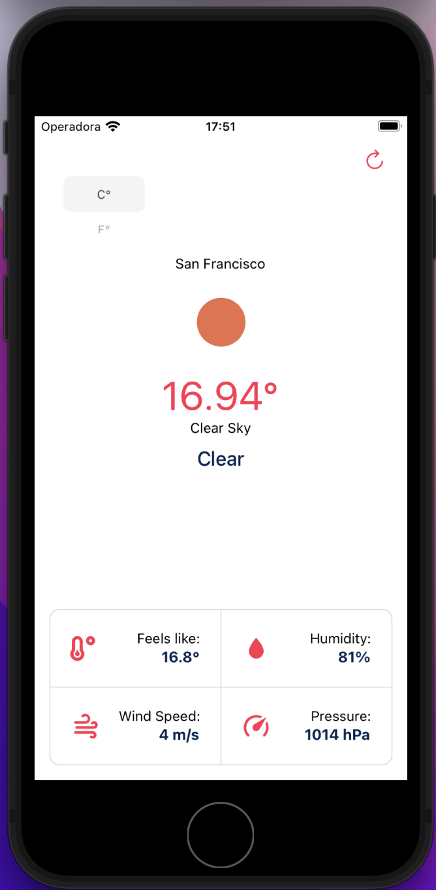
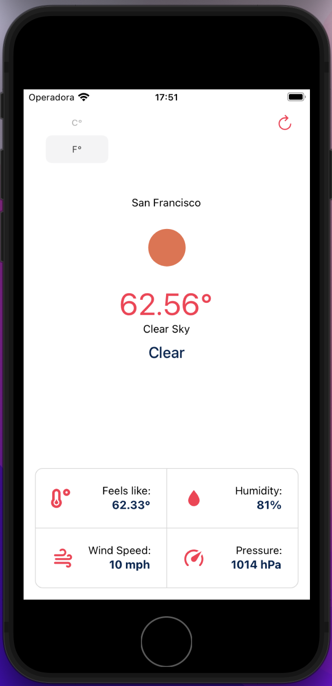

# Weather App:
Weather app created with React Native using <a href="https://openweathermap.org">open weather map</a> API for weather data.

## Using metric system:

&nbsp;

## Using imperial system:

&nbsp;

